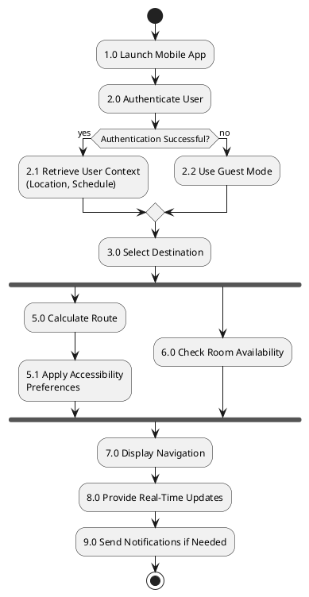

# 📊 ACTIVITY DIAGRAM - ПОДРОБНАЯ ИНСТРУКЦИЯ

## ЧТО ТАКОЕ ACTIVITY DIAGRAM?

**Activity Diagram** (диаграмма активности) - это UML диаграмма, которая показывает **поток действий** в системе от начала до конца.

В контексте вашего проекта: **Activity Diagram = FFBD (Functional Flow Block Diagram)**

**У вас уже есть готовая диаграмма**: `JP71QiCm38RlWRo3ZYbiBv0Urj32BbqexNROqRELHjIrWos7zUqdsnliPlJh__L9taLMWTFTjarvjKtRz4ULd9xXpN-HHHYMPIl58V6CZaahHlY86BQvboRe_Yda7LoIrXZZbEpB1h82tIV6JTi0z6VaGBZM0DXxn_ZDMUcEljgVuA9dDCdYHWQWZGZTwAjRJF2QCBAW6SooCpGLv0jQr.png`

---

## 📋 ТРЕБОВАНИЯ К ACTIVITY DIAGRAM

### Обязательные элементы:

1. **START узел** (●) - черная закрашенная точка
2. **END узел** (◉) - черная точка с кругом вокруг
3. **Activities (действия)** - прямоугольники со скругленными углами
4. **Decision points (решения)** - ромбы с условиями
5. **Transitions (переходы)** - стрелки между элементами
6. **Parallel execution (параллелизм)** - горизонтальные черные полосы (fork/join bars)

---

## ✅ ВАША ТЕКУЩАЯ ДИАГРАММА

### Структура (сверху вниз):

```
START (●)
  ↓
[1.0 Launch Mobile App]
  ↓
[2.0 Authenticate User]
  ↓
◇ Authentication Successful? (Decision)
  ├─ Yes → [2.1 Retrieve User Context (Location, Schedule)]
  └─ No → [2.2 Use Guest Mode]
  ↓
(Merge point ◇)
  ↓
[3.0 Select Destination]
  ↓
══════════════════════════════════ (Fork bar - parallel start)
  ↓                              ↓
[5.0 Calculate Route]        [6.0 Check Room Availability]
  ↓
[5.1 Apply Accessibility Preferences]
  ↓
══════════════════════════════════ (Join bar - parallel end)
  ↓
[7.0 Display Navigation]
  ↓
[8.0 Provide Real-Time Updates]
  ↓
[9.0 Send Notifications if Needed]
  ↓
END (◉)
```

---

## 🎯 СООТВЕТСТВИЕ ТРЕБОВАНИЯМ

| Требование | Есть в диаграмме | Статус |
|------------|------------------|--------|
| START node | ● (черная точка вверху) | ✅ |
| END node | ◉ (внизу) | ✅ |
| Activities (прямоугольники) | 10 активностей | ✅ |
| Decision point | Authentication Successful? | ✅ |
| Transitions (стрелки) | Все связи показаны | ✅ |
| Parallel execution | Fork после функции 3.0, Join перед 7.0 | ✅ |
| Нумерация функций | 1.0, 2.0, 2.1, 2.2, 3.0, 5.0, 5.1, 6.0, 7.0, 8.0, 9.0 | ✅ |
| Sub-functions | 5.1 (Apply Accessibility Preferences) | ✅ |

**ВЫВОД: Диаграмма полностью соответствует требованиям!** ✅

---

## 📝 EXPLANATORY NOTE (ОБЯЗАТЕЛЬНО!)

### Что должно быть в Explanatory Note (≤2 страницы):

**У вас уже есть текст в `Report_Content_COMPACT.txt` раздел 3.2!**

#### Структура Explanatory Note:

1. **Общий обзор** (1-2 параграфа)
   - Что показывает диаграмма
   - Какие основные этапы

2. **Описание каждой функции** (по порядку):
   - Function 1.0: Launch Mobile App
   - Function 2.0: Authenticate User
   - Function 2.1/2.2: Decision branch (Retrieve Context OR Guest Mode)
   - Function 3.0: Select Destination
   - Functions 5.0 & 6.0: Parallel execution
   - Function 5.1: Sub-function
   - Functions 7.0, 8.0, 9.0: Final steps

3. **Design Decisions** (почему так сделано):
   - Почему параллельные потоки?
   - Почему Guest Mode?
   - Как это связано с requirements?

4. **Alignment with Requirements**
   - Какие FR/NFR покрыты этой диаграммой

---

## ⚠️ КРИТИЧЕСКОЕ ИСПРАВЛЕНИЕ (из фидбека учителя)

### ИСПРАВЛЕНИЕ Function 2.1 - Guest Mode

**Проблема**: Guest Mode описан как "автоматический" при ошибке аутентификации.

**ИСПРАВЛЕННОЕ описание для Explanatory Note:**

```markdown
**Function 2.1 - Use Guest Mode (Updated):**

This is NOT an automatic fallback for failed authentication. 
When authentication fails, the system displays an error message 
and offers two options:
1. Retry login
2. Explicitly choose to proceed in guest mode

Guest mode is designed for visitors (prospective students, parents) 
who do not have university credentials. The branching logic should 
be interpreted as "user chooses guest mode" rather than "system 
forces guest mode."

**Security Note:** Guest mode provides limited functionality:
- ✅ Can: View public campus info, navigate to locations, search facilities
- ❌ Cannot: Access schedule integration, room booking, notifications
```

**Добавьте этот текст в раздел 3.2 Explanatory Note в Word документе!**

---

## 🛠️ ЕСЛИ НУЖНО ПЕРЕДЕЛАТЬ ДИАГРАММУ

### Вариант 1: PlantUML (текстовый код)



**Как использовать:**
1. Зайти на https://www.plantuml.com/plantuml/uml/
2. Вставить код
3. Скачать PNG
4. Вставить в Word

---

### Вариант 2: Draw.io / Lucidchart (вручную)

#### Шаг 1: Создать START
- Черный закрашенный круг (●)
- Диаметр ~10px

#### Шаг 2: Создать Activities
Прямоугольники со скругленными углами (rounded rectangles):
1. `1.0 Launch Mobile App`
2. `2.0 Authenticate User`
3. `2.1 Retrieve User Context`
4. `2.2 Use Guest Mode`
5. `3.0 Select Destination`
6. `5.0 Calculate Route`
7. `5.1 Apply Accessibility Preferences`
8. `6.0 Check Room Availability`
9. `7.0 Display Navigation`
10. `8.0 Provide Real-Time Updates`
11. `9.0 Send Notifications if Needed`

#### Шаг 3: Создать Decision Point
- Ромб (diamond)
- Текст внутри: `Authentication Successful?`
- Два выхода: "Yes" и "No"

#### Шаг 4: Создать Fork/Join Bars
- Горизонтальная черная полоса (толщина ~5px)
- **Fork** - после Activity 3.0 (разделяет поток на 2)
- **Join** - перед Activity 7.0 (объединяет обратно)

#### Шаг 5: Создать END
- Черная точка с кругом вокруг (◉)
- Внутренний круг ~8px, внешний ~14px

#### Шаг 6: Соединить стрелками
- Все элементы сверху вниз
- От Decision point две ветки (Yes/No)
- После Fork два параллельных потока

---

## 📸 CHECKLIST ДЛЯ ПРОВЕРКИ ДИАГРАММЫ

```
□ Есть START node (●)
□ Есть END node (◉)
□ Все activities имеют номера (1.0, 2.0, и т.д.)
□ Есть decision point (ромб)
□ Decision point имеет 2 выхода (Yes/No)
□ Есть Fork bar (горизонтальная полоса)
□ Есть Join bar (горизонтальная полоса)
□ Параллельные потоки показаны (5.0/5.1 и 6.0)
□ Есть sub-function (5.1)
□ Все элементы соединены стрелками
□ Диаграмма читаема (текст виден)
□ Диаграмма имеет заголовок
```

---

## 📄 КАК ВСТАВИТЬ В WORD

### Шаг 1: Вставка изображения
1. В Word, после заголовка **"Task 3: Functional Flow Block Diagram"**
2. Insert → Picture → выбрать файл `JP71QiCm38...png`
3. Отцентрировать (Ctrl+E)
4. Проверить размер (должна быть читаема)

### Шаг 2: Добавить подпись
1. Кликнуть на изображение
2. References → Insert Caption
3. Текст: `Figure 3: Functional Flow Block Diagram (FFBD) for Smart Campus Navigation System`

### Шаг 3: Вставить Explanatory Note
1. После изображения создать заголовок: **"3.2 EXPLANATORY NOTE"** (Heading 2)
2. Скопировать текст из `Report_Content_COMPACT.txt` раздел 3.2
3. **ВАЖНО:** Добавить исправленное описание Function 2.1 (см. выше)

### Шаг 4: Проверить длину
- Explanatory Note должна быть ≤2 страниц
- Если больше - используйте советы из `СРАВНЕНИЕ_ВЕРСИЙ.txt`

---

## 🎓 ТЕОРЕТИЧЕСКАЯ СПРАВКА

### Зачем нужна Activity Diagram?

1. **Показывает workflow** (последовательность действий)
2. **Визуализирует логику** (decision points, параллелизм)
3. **Документирует процесс** для разработчиков
4. **Помогает найти узкие места** (bottlenecks)

### Отличия от других диаграмм:

| Диаграмма | Что показывает |
|-----------|----------------|
| **Activity Diagram (FFBD)** | ПОТОК действий системы |
| **Use Case Diagram** | КТО использует систему и ЧТО делает |
| **Sequence Diagram** | ВЗАИМОДЕЙСТВИЕ между объектами |
| **Class Diagram** | СТРУКТУРА данных (классы и связи) |

---

## ✅ ФИНАЛЬНЫЙ ЧЕКЛИСТ ДЛЯ TASK 3

```
□ Диаграмма FFBD вставлена в Word
□ Диаграмма читаема и качественная
□ Есть подпись "Figure 3: ..."
□ Есть раздел "3.2 EXPLANATORY NOTE"
□ Explanatory Note содержит описание ВСЕХ функций
□ Добавлено исправленное описание Function 2.1 (Guest Mode)
□ Объяснен параллелизм (Functions 5.0 и 6.0)
□ Указано alignment with requirements
□ Длина ≤2 страниц
□ Проверена орфография (F7)
```

---

## 🚀 ГОТОВО К СДАЧЕ?

Если все пункты выше отмечены ✅ - **Task 3 готов!**

**Ожидаемая оценка за Task 3:** 14-15 из 15 баллов ✓

---

## 📚 ДОПОЛНИТЕЛЬНЫЕ РЕСУРСЫ

- **PlantUML Activity Diagram Guide**: https://plantuml.com/activity-diagram-beta
- **UML Activity Diagram Tutorial**: https://www.visual-paradigm.com/guide/uml-unified-modeling-language/what-is-activity-diagram/
- **Draw.io Activity Templates**: File → New → UML → Activity Diagram

---

## 💡 СОВЕТЫ

1. **Не усложняй**: Ваша диаграмма уже хорошая, не переделывай без необходимости
2. **Фокус на Explanatory Note**: Текст важнее чем диаграмма
3. **Исправь Guest Mode описание**: Это критично по фидбеку учителя
4. **Проверь длину**: ≤2 страницы для Explanatory Note

---

**УДАЧИ!** 🎯

